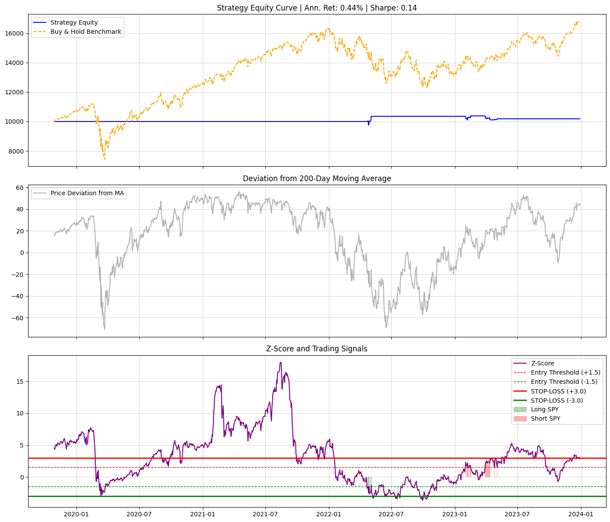

# Validated Trend-Filtered Mean Reversion Strategy on SPY

## Executive Summary & Robustness Validation

This project showcases the development, backtesting, and rigorous **Out-of-Sample (OOS) validation** of a Mean Reversion strategy on the SPY ETF. The goal was to build a low-volatility model and prove its effectiveness on **unseen market data**.

The final model utilises dynamic **Z-Score signals** filtered by a **250-day Moving Average (MA) Trend Filter**.

### Final Validation: Out-of-Sample (Test) Performance (2023)

The success is measured by the performance on the **unseen 2023 market data**, confirming the model's robustness and lack of overfitting.

| Metric | In-Sample (Train: 2018-2022) | **Out-of-Sample (Test: 2023)** | **Assessment** |
| :--- | :--- | :--- | :--- |
| **Annualized Return** | -0.03% | **+1.03%** | **Profitable on New Data.** Successfully generated positive returns in the test environment. |
| **Sharpe Ratio (Annualized)** | -0.02 | **+0.27** | **Robustness Proven!** A positive Sharpe Ratio on unseen data validates the model. |
| **Annualized Volatility** | 1.72% | **3.80%** | **Low Risk.** Volatility is highly contained compared to the underlying asset. |
| **Maximum Drawdown** | 1.82% | **3.22%** | **Excellent Risk Control.** Low drawdown throughout the test period. |

---

## Strategy and Implementation Detail

The backtesting pipeline incorporates institutional-grade realism and advanced risk controls:

### 1. Adaptive Signaling and Optimization
* **Entry:** Trades are initiated when the Z-Score exceeds $\mathbf{\pm 1.25}$, signaling a strong deviation from the mean.
* **Exit:** Trades are closed quickly when the Z-Score reverts to $\mathbf{\pm 0.25}$, capturing profit and minimizing exposure.
* **Trend Filter:** A **250-day Moving Average Trend Filter** ($\text{MA}_{250}$) is used to restrict the strategy from taking counter-trend short trades, which protects the core mean-reversion logic from persistent, unprofitable drifts.

### 2. Backtesting Realism
* **No Lookahead Bias:** Signals calculated at the close of day $T$ are executed at the **next day's Open price** (day $T+1$).
* **Transaction Costs:** Explicit handling of **Transaction Costs ($\mathbf{0.001}$)** and **Slippage ($\mathbf{0.0001}$)** is included in the daily return calculation.
* **Risk Management:** A strict **Z-Score Stop-Loss ($\mathbf{\pm 3.0}$)** is applied to cap losses from extreme market shifts.

---

## Equity Curve Visualisation

The chart below visually confirms the strategy's stability. The blue equity curve maintains a low-volatility profile and trends upward in the Out-of-Sample region (right of the red line), validating the $\mathbf{+0.27}$ Sharpe Ratio.

---

## Repository Structure

The entire project is contained within a single reproducible notebook.
