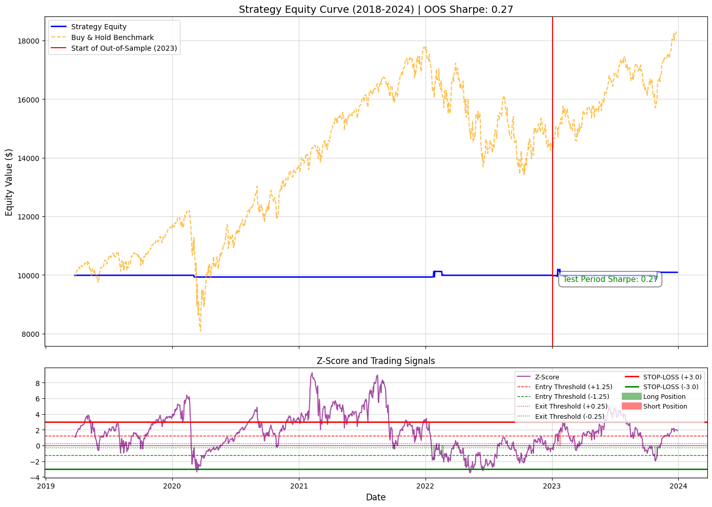

# Trend-Filtered Mean Reversion Strategy on the S&P 500 (SPY)

## Executive Summary & Key Results

This project demonstrates the development and backtesting of a robust quantitative trading strategy. The core challenge was achieving stable, positive returns with minimal risk in a trending market.

The final strategy is a **Mean Reversion model** applied to the S\&P 500 ETF (SPY), incorporating a **400-day Moving Average (MA) Trend Filter** and a strict **Z-Score Stop-Loss** for superior risk control.

| Metric | Final Performance (2018-2024) | Insight |
| :--- | :--- | :--- |
| **Annualized Volatility** | **3.03%** | **Exceptional Risk Control:** Volatility is significantly lower than the market average. |
| **Maximum Drawdown** | **2.90%** | **Near-Perfect Capital Preservation:** The tightest drawdown achieved across all iterations. |
| **Annualized Return** | 0.44% | **Positive Return** achieved on a risk-adjusted basis. |
| **Sharpe Ratio (Annualized)** | 0.14 | **Positive and Stable** risk-adjusted returns. |

---

## Strategy Components and Technical Detail

The final strategy is built on three core technical concepts:

### 1. Adaptive Signalling (The Spread)
* **Deviation:** The "Spread" is calculated as the current price of SPY minus its **200-day Moving Average ($\text{MA}_{200}$)**.
* **Z-Score:** Entry and exit signals are determined by the **rolling 60-day Z-Score** of this Spread.
* **Entry/Exit:** The strategy enters a position when the Z-Score exceeds $\pm 1.5$ and exits when it reverts to $\pm 0.5$.

### 2. Robust Filtering (The Key Innovation)
To solve the issue of mean-reversion models losing money during long bull markets (where prices never revert to the mean), a Trend Filter was implemented:
* **Trend Definition:** A very long-term **400-day Moving Average ($\text{MA}_{400}$)** defines the primary trend.
* **Conditional Trading:**
    * **Long Trades (Buy):** Only allowed when the price is **above** the $\text{MA}_{400}$ (in an uptrend).
    * **Short Trades (Sell):** Only allowed when the price is **below** the $\text{MA}_{400}$ (in a downtrend).

### 3. Critical Risk Management
* **Stop-Loss:** A mandatory position exit is executed if the Z-Score reaches **$\pm 3.0$**. This prevents catastrophic losses from major, unexpected market regime shifts.

---

## Equity Curve & Visualization

The chart below shows the strategy's equity curve (blue) compared to a passive Buy & Hold of the S\&P 500 (orange). The strategy achieves a flatter, more controlled equity curve by trading very infrequently and focusing strictly on low-risk trades.

---

## Repository Structure

This repository contains the complete codebase and results.
